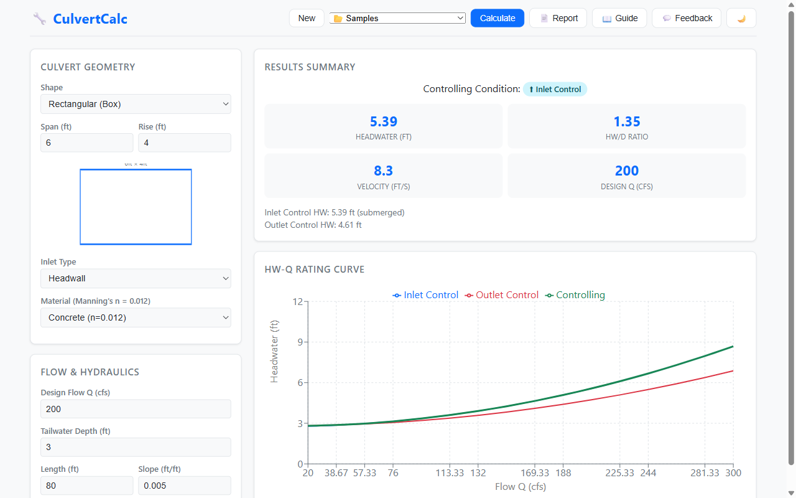

# CulvertFlow

**Browser-based culvert hydraulics calculator — FHWA HDS-5 in your browser, no install required.**



## What It Does

CulvertFlow replaces legacy desktop tools like HY-8 with a modern web app for sizing culverts per FHWA HDS-5. Enter your culvert geometry, inlet type, and design flow — get inlet control, outlet control, and the controlling headwater instantly, with an interactive HW-Q rating curve.

## Features

- **Three culvert shapes** — circular, rectangular, elliptical with live cross-section diagram
- **Inlet control** — HDS-5 unsubmerged & submerged equations with full coefficient tables
- **Outlet control** — entrance, friction, and exit losses via Manning's equation
- **Controlling headwater** — automatically reports which condition governs
- **HW-Q rating curve** — interactive chart (10%–150% of design Q) with hover values
- **Reference data** — built-in K/M/c/Y inlet coefficients, Manning's n, entrance loss Ke
- **Results summary** — design HW, velocity, pass/fail against allowable HW
- **Print report** — single-culvert summary with diagram, chart, and results table
- **Light/dark theme**

## Quick Start

```bash
# Prerequisites: Node.js 18+, pnpm
pnpm install
pnpm dev          # http://localhost:5173
pnpm test         # run engine tests
pnpm build        # production build
```

## Key Equations (FHWA HDS-5)

All equations are from FHWA Hydraulic Design Series No. 5 (public domain).

**Inlet control — unsubmerged:**

```
HW/D = Hc/D + K × (Q / (A × D^0.5))^M + Ks × S
```

**Inlet control — submerged:**

```
HW/D = c × (Q / (A × D^0.5))^2 + Y + Ks × S
```

**Outlet control:**

```
HW = H + ho − L × S
H  = (Ke + 19.63 × n² × L / R^1.33 + 1) × V² / 2g
```

Where K, M, c, Y = inlet coefficients by shape and inlet type; Ke = entrance loss coefficient; n = Manning's roughness; R = hydraulic radius; S = slope; D = rise.

## Tech Stack

| Layer | Technology |
|-------|------------|
| Engine | TypeScript (pure functions, zero dependencies) |
| Web UI | React 18 + Vite |
| Charts | Recharts |
| Monorepo | pnpm workspaces |
| Tests | Vitest |

## Project Structure

```
culvertflow/
├── packages/
│   ├── engine/src/          # Hydraulic calculation engine
│   │   ├── geometry.ts      # Area, wetted perimeter, hydraulic radius
│   │   ├── inlet-control.ts # HDS-5 inlet control equations
│   │   ├── outlet-control.ts# HDS-5 outlet control equations
│   │   ├── controlling.ts   # Inlet vs outlet comparison
│   │   ├── rating-curve.ts  # HW-Q curve generation
│   │   ├── reference.ts     # Coefficient tables (K, M, c, Y, n, Ke)
│   │   └── __tests__/       # Vitest specs
│   └── web/src/             # React web application
│       ├── components/
│       │   ├── InputForm.tsx      # Culvert geometry & flow inputs
│       │   ├── CrossSection.tsx   # Live cross-section diagram
│       │   ├── HWQChart.tsx       # HW-Q rating curve chart
│       │   ├── ResultsSummary.tsx  # Controlling condition & velocities
│       │   ├── PrintReport.tsx    # Print-friendly report
│       │   └── Toolbar.tsx        # New / Calculate / Report / Theme
│       └── App.tsx
├── PLAN.md
├── package.json
└── pnpm-workspace.yaml
```

## License

MIT
